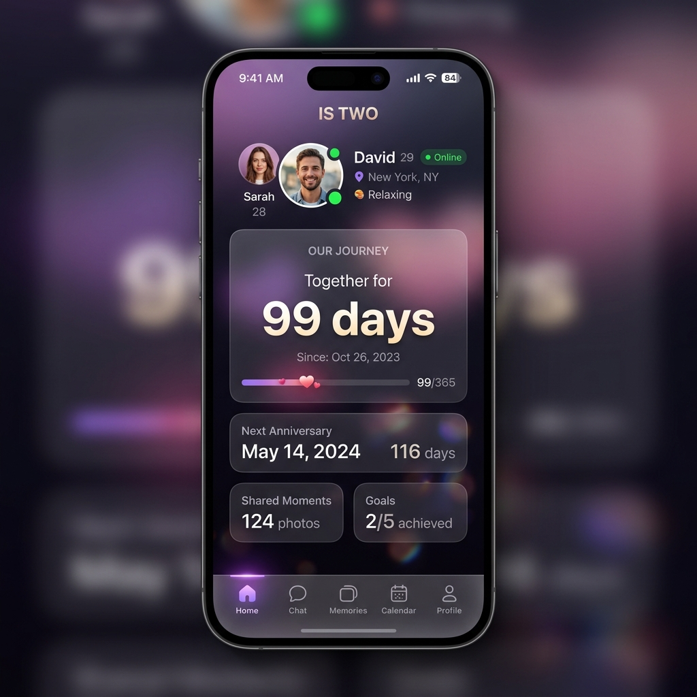
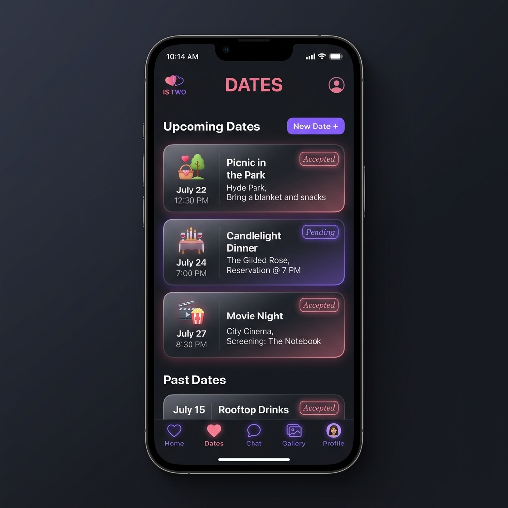
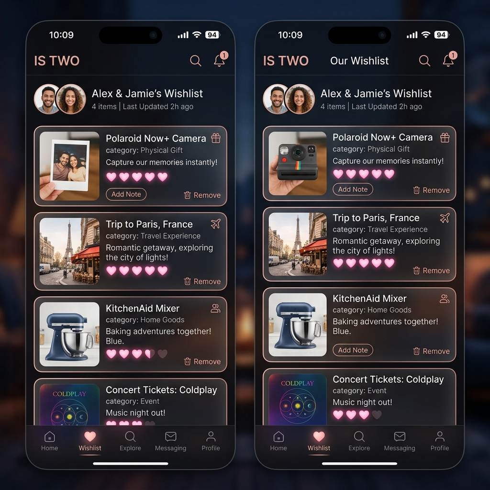
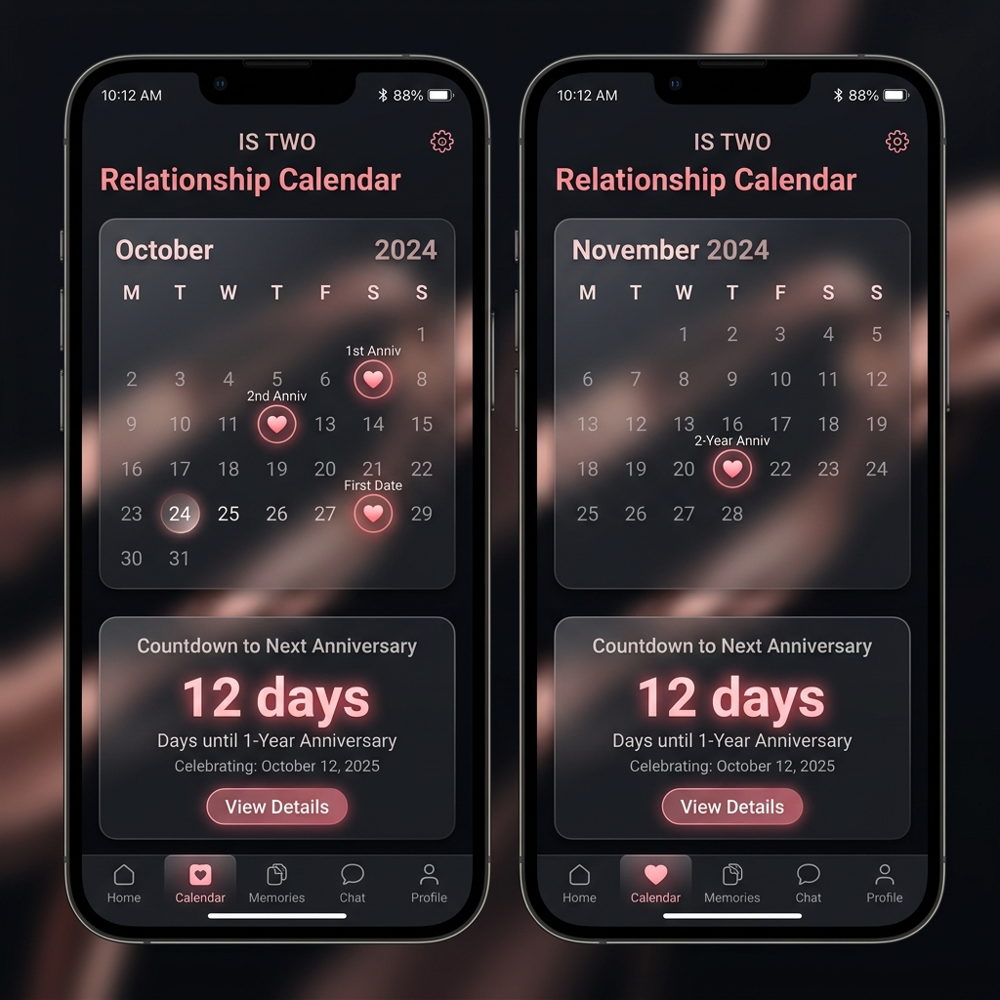
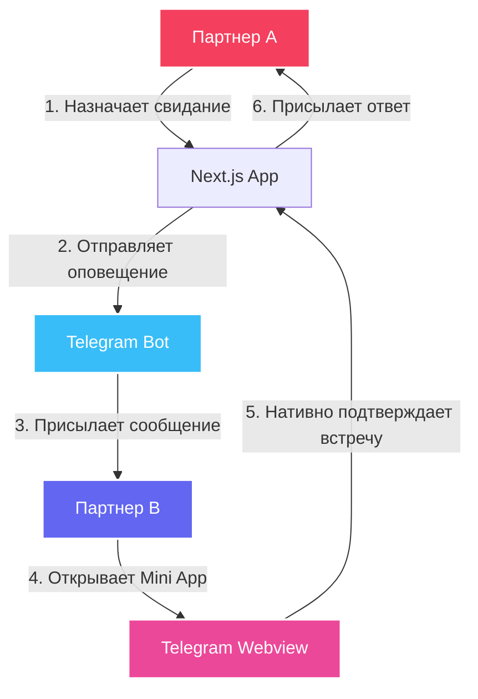

# IS TWO — Telegram Mini App для пар

IS TWO — приватное веб-приложение (Telegram Mini App), созданное для совместного использования парами. Приложение позволяет отслеживать знаменательные даты, вести общие списки желаний, сохранять отзывы о свиданиях и собирать общие подборки любимых вещей.

Доступ к приложению ограничен белым списком (whitelist) из двух Telegram ID.

---

## Скриншоты интерфейса
*(Сделайте скриншоты вашего запущенного Mini App и сохраните их в папку `public/screenshots/`, чтобы они автоматически отобразились здесь)*

| Главный экран | Детали свидания |
| :---: | :---: |
|  |  |

| Общий вишлист / Места | Календарь событий |
| :---: | :---: |
|  |  |

---

## Схема взаимодействия партнеров



---

## Архитектура и стек технологий

* **Frontend & Backend**: [Next.js](https://nextjs.org/) (App Router, React 19).
* **СУБД & ORM**: PostgreSQL (Supabase) + [Prisma](https://www.prisma.io/) (с поддержкой миграций и оптимизированным хранением изображений).
* **Интеграция с Telegram**: 
  * Telegram WebApp SDK (работа с BackButton, нативными подтверждениями `showConfirm`, тактильной отдачей `HapticFeedback`).
  * Бот-оповещения на базе [GrammY](https://grammy.dev/) (автоматические уведомления партнера о действиях в реальном времени).
* **Стилизация**: Tailwind CSS 4 + кастомный Glassmorphism дизайн.

---

## Ключевые возможности

1. **Главный дашборд**: Счетчик дней отношений, интерактивный статус партнера, быстрый доступ к основным разделам и умная система приглашений.
2. **Планирование свиданий (`/dates`)**: Возможность создать приглашение на свидание. Партнер получает оповещение через бота и может нативно принять или отклонить встречу. 
3. **Памятный фотоальбом**: После даты проведения свидания открывается доступ к заполнению отзывов, выбору эмодзи-впечатлений и загрузке фото (сжатие на клиенте перед отправкой в БД).
4. **Общий вишлист & Места (`/wishlist`)**: Разделение на физические подарки и места для посещения. Для мест реализована совместная шкала оценки интереса (от 1 до 5 сердечек).
5. **Наше любимое (`/favorites`)**: Общие списки лучших фильмов, музыки, мест и прочего с возможностью оставлять личные отзывы с каждой стороны.
6. **anniversary-календарь (`/calendar`)**: Годовщины и дни рождения с автоматическим расчетом возраста отношений и уведомлениями.

---

## Быстрый запуск

### 1. Настройка окружения
Создайте файл `.env` в корневой директории по шаблону `.env.example`:
```env
TELEGRAM_BOT_TOKEN="your_bot_token"
NEXT_PUBLIC_BOT_USERNAME="your_bot_username"
ALLOWED_TELEGRAM_IDS="id_1,id_2"
DATABASE_URL="postgresql://...:6543/postgres?pgbouncer=true"
DIRECT_URL="postgresql://...:5432/postgres"
NODE_ENV="development"
```

### 2. Установка зависимостей
```bash
npm install
```

### 3. База данных
Генерация клиента Prisma и применение миграций:
```bash
npx prisma generate
DATABASE_URL=$DIRECT_URL npx prisma migrate dev
```

### 4. Запуск приложения
Запустите сервер разработки Next.js и бота в двух разных терминалах:

**Терминал 1 (Next.js):**
```bash
npm run dev
```

**Терминал 2 (Telegram Bot Polling):**
```bash
npm run bot
```

---

## Детали оптимизации базы данных
Чтобы предотвратить замедление `SELECT` запросов при выводе списков, тяжелые Base64 строки загружаемых фотографий вынесены в отдельные таблицы `DateEventPhoto` и `WishlistItemPhoto` (связь 1:1). Они запрашиваются через `include` только при открытии детальных страниц.
