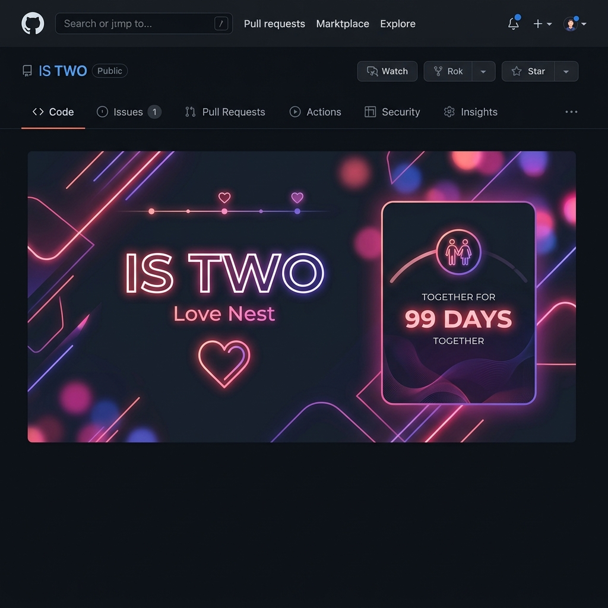
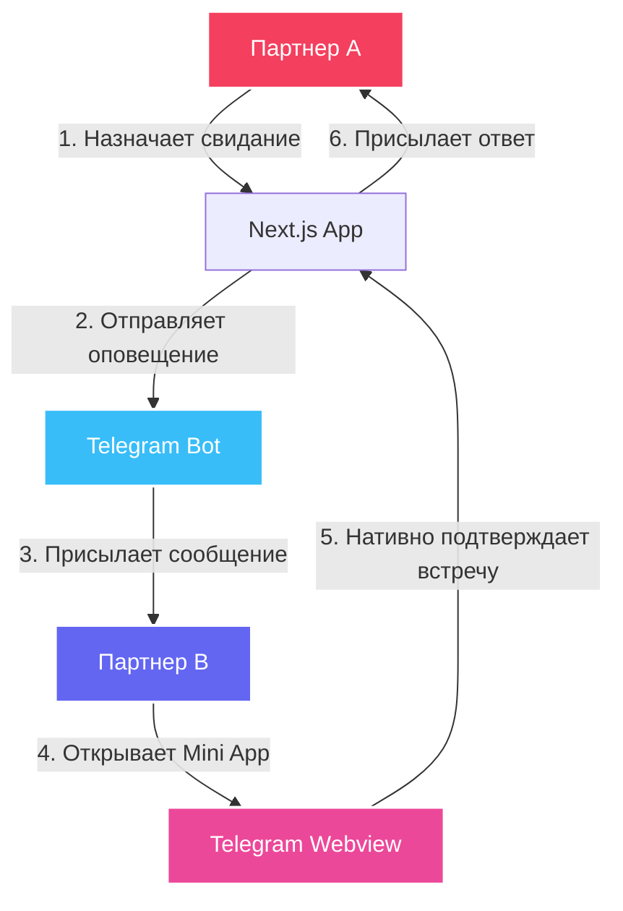

# IS TWO — Telegram Mini App для пар

<p align="center">
  
</p>

<p align="center">
  <em>Уютное цифровое гнездышко для двоих. Сохраняйте воспоминания, планируйте свидания и делитесь желаниями.</em><br>
  <strong>Приватное пространство с доступом только для вашей пары.</strong>
</p>

<p align="center">
  
  
  
  
  
  
</p>

---

## 🌸 Скриншоты интерфейса

| Главный экран | Детали свидания |
| :---: | :---: |
|  |  |

| Общий вишлист / Места | Календарь событий |
| :---: | :---: |
|  |  |

---

## 🔄 Схема взаимодействия партнеров



---

## 🌟 Ключевые возможности

| Раздел | Описание | Особенности |
|---|---|---|
| **📊 Главный дашборд** | Общий счетчик дней отношений, статус партнера в реальном времени, панель быстрой навигации. | Анимированные счетчики, индикация онлайна. |
| **📅 Планирование свиданий (`/dates`)** | Создание приглашений на свидания, заполнение отзывов, загрузка памятных фотографий. |  Клиентское сжатие картинок, Telegram оповещения. |
| **💖 Общий вишлист & Места (`/wishlist`)** | Разделение на материальные подарки и места, которые вы хотите посетить вдвоем. | Оценка интереса (1-5 сердечек) с обеих сторон. |
| **🎶 Наше любимое (`/favorites`)** | Персональные списки лучшего: фильмов, музыки, книг, мест с личными рецензиями. | Раздельные заметки для каждого из партнеров. |
| **🗓️ Календарь событий (`/calendar`)** | Памятные даты, годовщины, дни рождения с автоматическим расчетом возраста отношений. | Умные пуш-уведомления об общих годовщинах. |

---

## 🚀 Быстрый запуск

### 1. Настройка окружения
Создайте файл `.env` в корневой директории по шаблону `.env.example`:
```env
TELEGRAM_BOT_TOKEN="your_bot_token"
NEXT_PUBLIC_BOT_USERNAME="your_bot_username"
ALLOWED_TELEGRAM_IDS="id_1,id_2"
DATABASE_URL="postgresql://...:6543/postgres?pgbouncer=true"
DIRECT_URL="postgresql://...:5432/postgres"
NODE_ENV="development"
```

### 2. Установка зависимостей и проверка
```bash
npm install
npm run doctor # Запуск автоматической диагностики окружения
```

### 3. Настройка базы данных (Prisma)
Примените миграции и сгенерируйте типы:
```bash
npm run db:generate
npm run db:migrate
```

### 4. Запуск локального сервера
Вам понадобится запустить два процесса в разных терминалах:
```bash
# Терминал 1: запуск Next.js веб-сервера
npm run dev

# Терминал 2: запуск Telegram бота (Long Polling)
npm run bot
```

---

## ⚙️ Оптимизации базы данных (Base64 Decoupling)
Для поддержания высокой производительности приложения, тяжелые Base64 строки фотографий свиданий (`DateEventPhoto`) и вишлиста (`WishlistItemPhoto`) вынесены в отдельные таблицы с отношением 1:1. Это предотвращает замедление списочных запросов `SELECT` — фотографии подгружаются через `include` только при переходе на детальные экраны элементов.
